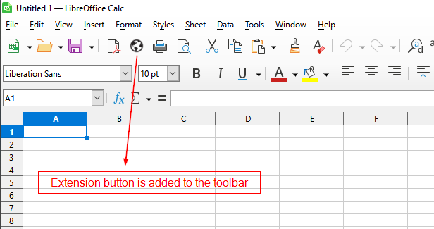
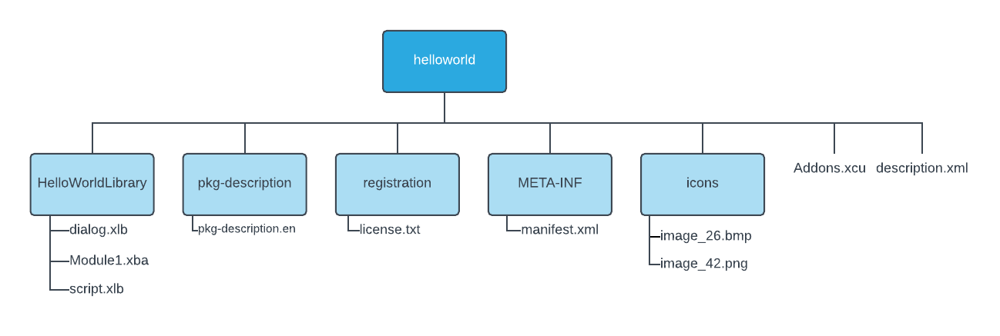

# LibreOffice extension
This LibreOffice extension `*.oxt` file adds a button to standand toolbar of LibreOffice Calc. When button is clicked, the process is run.

  

### How to install

1. Open LibreOffice Calc.
2. Go to Tools > Extension Manager
3. Click ADD button, and select the extension `*.oxt` file.
4. Follow the installation instructions.
5. Restart LibreOffice Calc.

### Extension file structure

  

### How to package the extension

1. Select all files inside repository folder. It won't work if you compress the entire parent folder, because description.xml must be located at the top level.
2. Right-click and compress to `*.zip`.
3. Rename `*.zip` to `*.oxt`.
